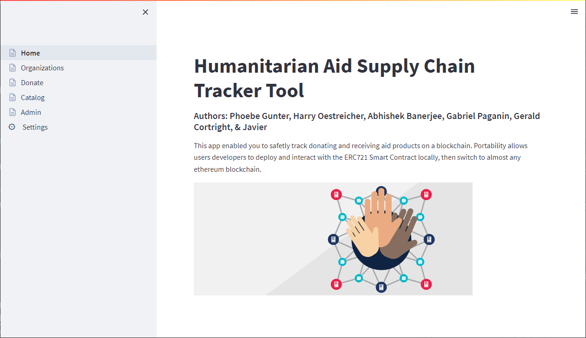

# SaveTheWorld Token

## Motive

Currently, charitable foundations spend about 30% of donations in administrative expenses. Such event depletes the amount of resources delivered to people in need. Reducing the involvement of intermediary institutions will inevitably translate into more help for the intended recipients. 

Traditional charity systems have an intrinsic lack of transparency. Donors have no way to track or ensure assistance is getting to the right place. This has generated a high degree of mistrust towards charitable foundations. This could be improved by providing users with efficient ways to track donations and moreover, make each transaction distinguishable from the others. Such improvement would help restoring donor confidence and consequently, increase overall donations.

Saving the world solves both mentioned problems in traditional charity systems (admin costs and transparency). It provides an efficient blockchain system which processes and records transactions directly from donor to supplier. This last delivers resources directly to the end recipient without the need of intermediaries. In addition, each donation is completely trackable and stored as a non-fungible token.

## Overview 

This MVP is a proof-of-concept to explore the viability of Blockchains to store immutable data for tokenized assets in the Relief Aid domain. A Smart Contract using ERC721 is used to collect parameters from our application and write to blockchain.

To improve and ecconomize gas usage, we've integrated a free IPFS service to store tokenized information for each asset 'donated' through our app. This could be greatly improved by hosting an IPFS node and it's infrastructure. This is most often done using cloud services like AWS GPC or Azure to host an ethereum node.

For this app, we've used Ganache to simulate the Smart Contract deployment, the mining, and the transaction storage. We've used the Pinata public IPFS cloud to store _some_ donated asset metadata and the tokenized image. To modify the _allowed_ amount of storage would have been out of scope for this project, so we store most metadata in Ganache.  In a production scenario, all metadata is tokenized and stored on a public IPFS chain.

## Requirements

- [Streamlit](https://streamlit.io/) - User interface
- [Python](https://www.python.org/) - We use [Anaconda]() to manage Python environment.
- [Ganache](https://trufflesuite.com/ganache/) - Local blochain for dev/testing
- [Web3.py](https://web3py.readthedocs.io/en/stable/) - Smart Contract interaction
- [Remix - remix.ethereum.org](https://remix.ethereum.org/)
- [Pinata](https://gateway.pinana.cloud) or other IPFS host provider (API Key and Secret API Key)
- [MetaMask](https://metamask.io/) - Installed into your chrome or edge browser. We will create dummy accounts to run the app.


## Getting Started & Running the Code

### 1. Setup Python environment

1.1 Create a conda environment and activate it
```bash (base)
conda create -n stw python=3.7 anaconda -y
conda activate stw

```
1.2 Install the required packages (make sure `stw` is activated first)
```bash (stw)
python -m ipykernel install --user --name stw
conda install -c conda-forge nodejs -y
pip install python-dotenv
pip install web3
pip install streamlit
pip install SQLAlchemy 

```
1.3 Clone this repository.

```bash (stw)
git clone git@github.com:Saving-the-world-org/save_the_world.git
cd save_the_world/

```
---

### 2. Setup persistent data in .env file:

Copy the PROJECT23.env to .env then replace required values:

``` (.env file)
(.env file)

NETWORK="development"
WEB3_PROVIDER_URI="http://127.0.0.1:7545"
SMART_CONTRACT_ADDRESS="YOUR_SMART_CONTRACT_ADDRESS"
ABI_PATH="contracts/compiled/save_the_world_abi.json"
IPFS_URI="https://gateway.pinata.cloud/ipfs/"
PINATA_API_KEY="YOUR_PINATA_API_KEY"
PINATA_SECRET_API_KEY="YOUR_PINATA_SECRET_API_KEY"
PUBLIC_KEY="YOUR_MINTER_ACCOUNT_PUBLIC_ADDRESS"
PRIVATE_KEY="YOUR_MINTER_ACCOUNT_PRIVATE_KEY"
INFURA_KEY=""

```
### 3. Start your local Ganache blockchain


### 4. Import Ganache accounts into MetaMask plugin.

[Create Ganache local network and import accounts into MetaMask](https://www.geeksforgeeks.org/how-to-set-up-ganche-with-metamask/#:~:text=Ganache%20CLI,on%20the%20ganache%20blockchain%20successfully.)

### 5. Deploy Smart Contract in Remix

5.1 In remix, copy the contents of `/contracts/save_the_world_ERC721.sol` into a new .sol file in remix. The name doesn't matter.  Just the version of Solidity (^0.8.7) and the account addresses from your local ganache blockchain you would like to assign specific [ERC721 Roles](https://docs.openzeppelin.com/contracts/4.x/access-control) in our deployment:

(import your accounts into MetaMask as shown in this screenshot - Account 2, Account 3, etc...)


5.2 Switch to the `Deploy and Run Transactions` tab and change to: 
`Injected Provider - MetaMask`  You might be prompted for your MetaMask password.


5.3 Click the `Deploy Contract` button and fetch your new contract address for the .env file.


...

SMART_CONTRACT_ADDRESS="`<paste here>`"

...

### 6. Launch Streamlit App

From within the project directory, run the Streamlit app. The first time it's run, plase got tpo teh Settings page and click the `RESET ALL db tables`.


```bash (stw)
streamlit run Home.py

```
### Home Page



### Organizations Page

This page can be built out into a management solution for onboarding new organizations or managign existing ones.


### Donate Page

This page uses inheritance to conveniently populate dropdowns selections based on category, type of donation. etc.


### Catalog Page

This would be built our as well into a MVC-type solution to manage a catalog of resources (to be donated/minted).


### System Settings Page

This is where the local db is prepopulated with data from CSV files to provide list or resources, organizations, and ethereum addresses associated with said organizations.


### Example STW Token URI:

The minted tokens are stored in the pinata.cloud ipfs platform.

Example IPFS Tokenized Relief Asset (STW Token):
- [token](https://gateway.pinata.cloud/ipfs/QmT3dxsNK2wmNb1KRUtZMxr456VFzLE36RivdhYG9nVb3Z)
- [token metadata](https://gateway.pinata.cloud/ipfs/bafkreictziodueto6xhrmvtjkdwvnuyrn3yqg5zu5bzwixfufrfmyomaeq)
      
NOTE: This MVP only stores variables allow within the Pinata free tier.

